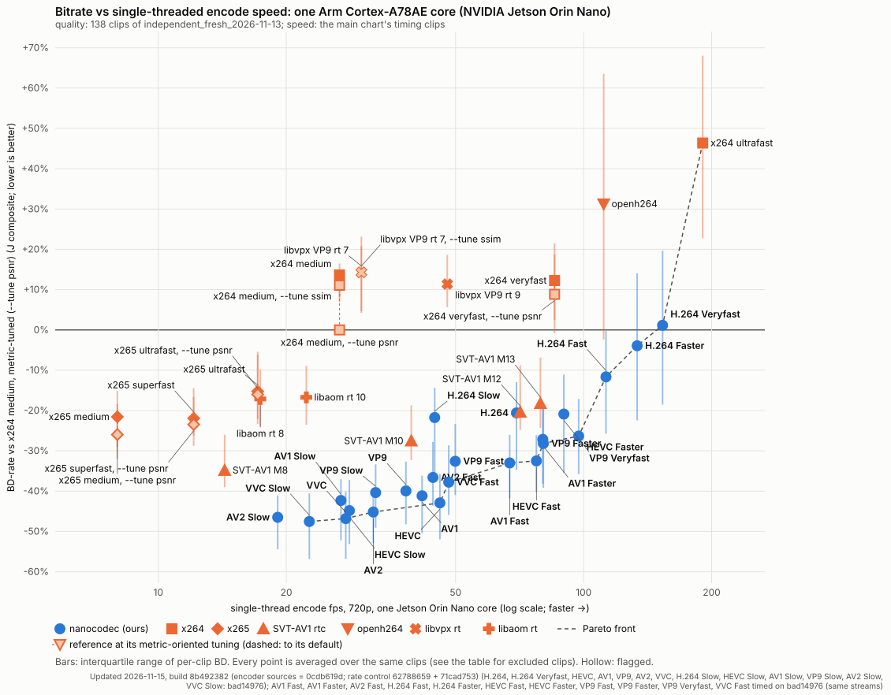
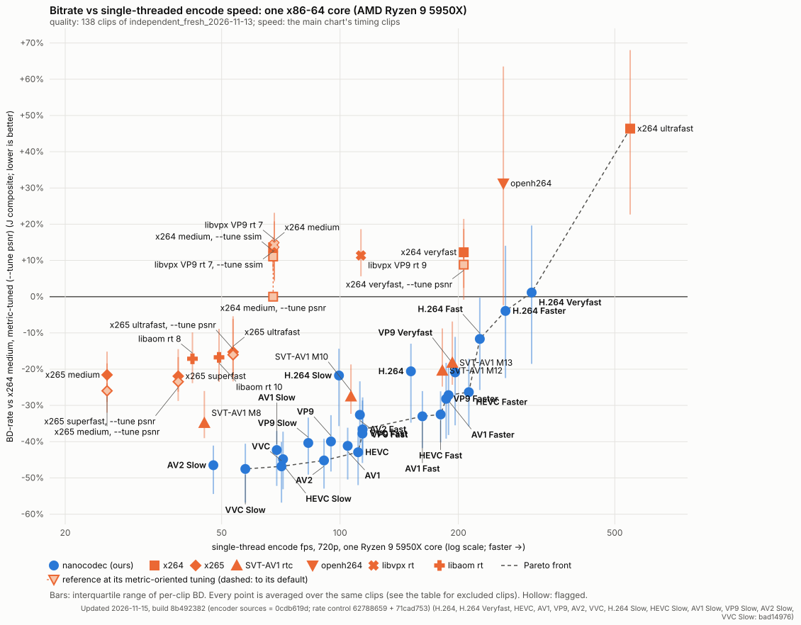

# Bitrate vs encode speed, held-out clips (independent_fresh_2026-11-13), zero line x264-medium~psnr

Updated 2026-11-20, build 8b492382 (encoder sources = 0cdb619d; rate control 62788659 + 71cad753) (H.264 Fast, H.264 Faster, H.264 Veryfast, HEVC, HEVC Fast, HEVC Faster, AV1, AV1 Fast, AV1 Faster, AV1 Veryfast, VP9, VP9 Fast, VP9 Faster, VP9 Veryfast, AV2, AV2 Fast, VVC, VVC Fast, H.264 Slow, HEVC Slow, AV1 Slow, VP9 Slow, AV2 Slow, VVC Slow, AV2 Faster: 20d31869; H.264: c9cff89f); H.264 timed on 20d31869 (same streams)

**Zero line: x264 medium, metric-tuned (--tune psnr)** (the default-tuned x264 medium is a row of its own). The low rungs are the default chart's, so the points are the same.

Quality on the 138 clips of `independent_fresh_2026-11-13`. Speed is the main chart's: timed on its three timing clips (lowlight_city_night, crowd_mot17_09, bodycam_bc1; tools/dev/anchor_chart_timing.py), not on these clips.

The same on x86 (one Ryzen 9 5950X core):

| Encoder | BD-J | BD-PSNR-YUV | BD-VMAF v1 | per-clip IQR (BD-J) | fps (Jetson, 1 core) | speed vs x264 medium | fps (x86, 1 core) | x86 speed vs x264 medium | clips | notes |
|---|---:|---:|---:|---|---:|---:|---:|---:|---:|---|
| **VVC Slow** | -49.4% | -49.7% | -48.7% | -57.4 … -42.0 | 16.0 | 0.60× | 64.4 | 0.57× | 137/137 | Pareto; Pareto x86 |
| **AV2 Slow** | -48.3% | -51.3% | -46.6% | -55.8 … -43.3 | 16.1 | 0.60× | 62.3 | 0.55× | 137/137 | Pareto |
| **VVC** | -47.6% | -47.8% | -47.0% | -56.4 … -41.2 | 29.8 | 1.12× | 121.0 | 1.07× | 137/137 | Pareto; Pareto x86 |
| **HEVC Slow** | -47.4% | -47.7% | -45.6% | -55.3 … -40.1 | 19.0 | 0.71× | 76.9 | 0.68× | 137/137 |  |
| **AV2** | -45.8% | -49.0% | -44.1% | -54.7 … -39.1 | 39.2 | 1.47× | 170.1 | 1.51× | 137/137 | Pareto; Pareto x86 |
| **HEVC** | -44.5% | -44.9% | -43.1% | -53.0 … -37.0 | 45.3 | 1.70× | 171.9 | 1.52× | 137/137 | Pareto; Pareto x86 |
| **AV1 Slow** | -44.1% | -47.4% | -40.3% | -52.9 … -39.9 | 26.6 | 1.00× | 113.3 | 1.00× | 137/137 | 1 rate-invalid pts |
| **VVC Fast** | -42.7% | -43.1% | -41.5% | -52.9 … -34.1 | 53.2 | 1.99× | 205.2 | 1.82× | 137/137 | Pareto; Pareto x86 |
| **AV1** | -41.7% | -45.5% | -38.7% | -51.2 … -37.0 | 45.7 | 1.71× | 181.4 | 1.61× | 137/137 | 1 rate-invalid pts |
| **AV2 Fast** | -41.6% | -43.3% | -38.0% | -51.4 … -32.9 | 51.8 | 1.94× | 230.8 | 2.05× | 137/137 | Pareto x86 |
| **VP9 Slow** | -41.2% | -43.8% | -37.3% | -50.9 … -33.7 | 26.7 | 1.00× | 100.0 | 0.89× | 137/137 | 2 rate-invalid pts |
| **VP9** | -40.8% | -43.4% | -37.2% | -50.0 … -32.5 | 42.1 | 1.58× | 171.0 | 1.52× | 137/137 | 3 rate-invalid pts |
| **AV2 Faster** | -40.1% | -41.7% | -36.4% | -50.2 … -31.3 | 62.9 | 2.36× | 274.8 | 2.44× | 137/137 | Pareto; Pareto x86 |
| **HEVC Fast** | -39.4% | -39.7% | -36.2% | -48.3 … -32.1 | 72.0 | 2.70× | 293.2 | 2.60× | 137/137 | Pareto; Pareto x86 |
| **AV1 Fast** | -38.4% | -41.6% | -34.4% | -48.5 … -31.6 | 66.2 | 2.48× | 267.6 | 2.37× | 137/137 |  |
| **VP9 Fast** | -36.0% | -38.6% | -30.4% | -44.8 … -27.4 | 55.8 | 2.09× | 233.7 | 2.07× | 137/137 | 1 rate-invalid pts |
| **AV1 Faster** | -35.7% | -37.1% | -33.7% | -46.6 … -28.5 | 79.4 | 2.98× | 323.9 | 2.87× | 137/137 | Pareto; Pareto x86 |
| SVT-AV1 M8 | -35.4% | -37.1% | -27.3% | -39.9 … -26.3 | 14.3 | 0.53× | 80.8 | 0.72× | 137/137 | 27 rate-invalid pts |
| **HEVC Faster** | -32.6% | -32.9% | -29.1% | -43.4 … -25.4 | 90.3 | 3.38× | 364.2 | 3.23× | 137/137 | Pareto; Pareto x86 |
| **VP9 Faster** | -31.7% | -31.6% | -27.9% | -43.9 … -21.5 | 92.3 | 3.46× | 368.7 | 3.27× | 137/137 | Pareto; Pareto x86 |
| **AV1 Veryfast** | -30.1% | -30.1% | -26.5% | -42.5 … -20.1 | 96.5 | 3.62× | 431.4 | 3.83× | 137/137 | Pareto; Pareto x86 |
| SVT-AV1 M10 | -28.1% | -28.7% | -21.5% | -32.8 … -19.1 | 39.3 | 1.47× | 228.9 | 2.03× | 137/137 | 25 rate-invalid pts |
| **VP9 Veryfast** | -27.9% | -29.1% | -23.7% | -39.4 … -19.3 | 95.8 | 3.59× | 385.9 | 3.42× | 137/137 |  |
| x265 medium, metric-tuned (--tune psnr) | -26.4% | -27.0% | -21.4% | -33.1 … -18.7 | 8.0 | 0.30× | 38.0 | 0.34× | 137/137 | 32 rate-invalid pts; fps of the default-tuned run; re-timing pending |
| **H.264 Slow** | -25.8% | -29.6% | -23.4% | -39.7 … -18.1 | 37.2 | 1.39× | 115.3 | 1.02× | 137/137 |  |
| x265 superfast, metric-tuned (--tune psnr) | -24.0% | -23.3% | -18.7% | -29.8 … -16.7 | 12.1 | 0.45× | 57.9 | 0.51× | 137/137 | 30 rate-invalid pts; fps of the default-tuned run; re-timing pending |
| **H.264** | -23.7% | -26.9% | -21.7% | -38.5 … -15.7 | 66.4 | 2.49× | 202.2 | 1.79× | 137/137 |  |
| x265 superfast | -22.5% | -20.3% | -17.7% | -27.9 … -15.1 | 12.1 | 0.45× | 57.9 | 0.51× | 137/137 | 31 rate-invalid pts |
| x265 medium | -22.2% | -20.2% | -14.8% | -29.3 … -15.3 | 8.0 | 0.30× | 38.0 | 0.34× | 137/137 | 34 rate-invalid pts |
| SVT-AV1 M12 | -21.0% | -20.6% | -16.1% | -26.6 … -9.1 | 70.9 | 2.67× | 408.7 | 3.62× | 137/137 | 21 rate-invalid pts |
| SVT-AV1 M13 | -18.9% | -18.1% | -14.3% | -25.1 … -6.9 | 79.2 | 2.96× | 445.4 | 3.95× | 137/137 | Pareto x86; 21 rate-invalid pts |
| libaom rt 8 | -17.1% | -14.7% | -11.6% | -23.7 … -10.0 | 17.4 | 0.65× | 68.8 | 0.61× | 137/137 | 94 rate-invalid pts |
| libaom rt 10 | -16.9% | -16.6% | -9.7% | -23.6 … -9.0 | 22.3 | 0.83× | 90.5 | 0.80× | 137/137 | 96 rate-invalid pts |
| x265 ultrafast, metric-tuned (--tune psnr) | -16.8% | -15.3% | -11.5% | -25.5 … -6.5 | 17.1 | 0.64× | 85.1 | 0.75× | 137/137 | 30 rate-invalid pts; fps of the default-tuned run; re-timing pending |
| x265 ultrafast | -16.1% | -13.2% | -11.2% | -24.0 … -5.8 | 17.1 | 0.64× | 85.1 | 0.75× | 137/137 | 30 rate-invalid pts |
| **H.264 Fast** | -16.1% | -19.0% | -13.5% | -31.9 … -5.6 | 119.5 | 4.48× | 370.1 | 3.28× | 137/137 | Pareto |
| **H.264 Faster** | -8.0% | -12.2% | -4.3% | -28.8 … +10.6 | 146.9 | 5.51× | 460.1 | 4.08× | 137/137 | Pareto; Pareto x86 |
| **H.264 Veryfast** | -4.9% | -9.9% | -0.6% | -24.8 … +14.1 | 164.1 | 6.15× | 520.2 | 4.61× | 137/137 | Pareto; Pareto x86 |
| x264 medium, metric-tuned (--tune psnr) | +0.0% | +0.0% | +0.0% | +0.0 … +0.0 | 26.7 | 1.00× | 112.8 | 1.00× | 137/137 | 47 rate-invalid pts; fps of the default-tuned run; re-timing pending |
| x264 veryfast, metric-tuned (--tune psnr) | +8.0% | +4.3% | +7.4% | -4.2 … +17.4 | 85.4 | 3.18× | 363.3 | 3.22× | 137/137 | 1 rate-invalid pts; fps of the default-tuned run; re-timing pending |
| x264 medium, metric-tuned (--tune ssim) | +10.7% | +8.2% | +26.7% | +6.9 … +14.6 | 26.7 | 1.00× | 112.8 | 1.00× | 137/137 | 40 rate-invalid pts; fps of the default-tuned run; re-timing pending |
| x264 veryfast | +11.1% | +5.1% | +26.4% | -0.4 … +20.2 | 85.4 | 3.18× | 363.3 | 3.22× | 137/137 | 1 rate-invalid pts |
| libvpx VP9 rt 9 | +11.5% | +18.6% | +16.3% | +5.6 … +18.7 | 47.8 | 1.78× | 204.4 | 1.81× | 137/137 | 161 rate-invalid pts |
| x264 medium | +13.4% | +11.0% | +27.4% | +7.8 … +16.3 | 26.7 | 1.00× | 112.8 | 1.00× | 137/137 | 42 rate-invalid pts |
| libvpx VP9 rt 7 | +14.7% | +19.6% | +19.0% | +4.9 … +23.7 | 30.0 | 1.12× | 122.7 | 1.09× | 137/137 | 155 rate-invalid pts |
| libvpx VP9 rt 7, metric-tuned (--tune ssim) | +14.7% | +19.7% | +24.1% | +4.5 … +22.5 | 30.0 | 1.12× | 122.7 | 1.09× | 137/137 | 135 rate-invalid pts; fps of the default-tuned run; re-timing pending |
| openh264 | +31.0% | +27.5% | +41.3% | -4.3 … +63.5 | 111.5 | 4.17× | 524.7 | 4.65× | 137/137 | Pareto x86; 253 rate-invalid pts |
| x264 ultrafast | +44.5% | +51.3% | +35.3% | +19.7 … +67.7 | 190.5 | 7.11× | 1017.0 | 9.02× | 137/137 | Pareto; Pareto x86; 1 rate-invalid pts |

Low rungs (40 / 75 kbps, every encoder) on: ind_bdd100k_mot_bdd_00cea101_06f21d5e, ind_bdd100k_mot_bdd_00d0f034_6d666f7b, ind_bdd100k_mot_bdd_00d1bafa_1b47b41c, ind_bdd100k_mot_bdd_00d9e313_038310a2, ind_bdd100k_mot_bdd_00d9e313_7d75bb18, ind_bwc_videotext_video219, ind_bwc_videotext_video28, ind_bwc_videotext_video295, ind_bwc_videotext_video317, ind_bwc_videotext_video321, ind_bwc_videotext_video33, ind_bwc_videotext_video345, ind_bwc_videotext_video347, ind_bwc_videotext_video354, ind_bwc_videotext_video61, ind_bwc_videotext_video88, ind_cctv_inof_ld_out_light_ffcam_002, ind_cevo_april25_inof_ld_in_light_ffcam_002, ind_cevo_april25_inof_ld_outld_light_ffcam_001, ind_cevo_april25_inof_md_out_light_ffcam_003, ind_chirla_chirla_seq_020_camera_2_2023_07_26_13_21_40, ind_chirla_chirla_seq_026_camera_3_2023_12_05_12_12_13, ind_jaad_video_0015, ind_jaad_video_0018, ind_jaad_video_0019, ind_jaad_video_0042, ind_jaad_video_0051, ind_jaad_video_0076, ind_jaad_video_0102, ind_meva_2018_03_07_17_00_00_17_05_00_bus_g508, ind_meva_2018_03_07_17_05_00_17_10_00_bus_g508, ind_meva_2018_03_13_16_10_00_16_15_00_bus_g505, ind_mot_mot20_01, ind_mp4_waiting_area1, ind_otw_homes_00310, ind_otw_homes_00394, ind_personpath22_uid_vid_00019, ind_personpath22_uid_vid_00079, ind_personpath22_uid_vid_00106, ind_personpath22_uid_vid_00142, ind_personpath22_uid_vid_00172, ind_personpath22_uid_vid_00173, ind_personpath22_uid_vid_00177, ind_personpath22_uid_vid_00190, ind_personpath22_uid_vid_00195, ind_personpath22_uid_vid_00200, ind_personpath22_uid_vid_00208, ind_personpath22_uid_vid_00212, ind_personpath22_uid_vid_00214, ind_personpath22_uid_vid_00216, ind_personpath22_uid_vid_00231, ind_uvg_vcm_uvgvcm_jobfair. Clips left out for every encoder: 1; chained (point, clip) pairs: 0.

## Class-weighted and clip-weighted BD-J

The chart's BD-J weights every content class equally (bodycam 12, crowd 39, lowlight 8, pan 42, static 36 clips); clip-weighted counts every clip equally. Same clips and rungs; the clip-weighted mean is over the directly compared clips (no chained rows).

| Point | BD-J class-weighted | BD-J clip-weighted |
|---|---:|---:|
| x264 medium | +13.4% | +12.3% |
| H.264 Slow | -25.8% | -27.8% |
| H.264 | -23.7% | -25.9% |
| H.264 Fast | -16.1% | -17.6% |
| H.264 Faster | -8.0% | -9.0% |
| H.264 Veryfast | -4.9% | -5.6% |
| HEVC Slow | -47.4% | -47.6% |
| HEVC | -44.5% | -44.8% |
| HEVC Fast | -39.4% | -40.3% |
| HEVC Faster | -32.6% | -33.8% |
| AV1 Slow | -44.1% | -46.2% |
| AV1 | -41.7% | -43.9% |
| AV1 Fast | -38.4% | -39.9% |
| AV1 Faster | -35.7% | -37.6% |
| AV1 Veryfast | -30.1% | -31.3% |
| VP9 Slow | -41.2% | -42.1% |
| VP9 | -40.8% | -41.6% |
| VP9 Fast | -36.0% | -36.3% |
| VP9 Faster | -31.7% | -32.2% |
| VP9 Veryfast | -27.9% | -28.9% |
| AV2 Slow | -48.3% | -49.6% |
| AV2 | -45.8% | -46.9% |
| AV2 Fast | -41.6% | -42.1% |
| AV2 Faster | -40.1% | -40.6% |
| VVC Slow | -49.4% | -50.0% |
| VVC | -47.6% | -48.4% |
| VVC Fast | -42.7% | -43.3% |
| openh264 | +31.0% | +28.6% |
| x264 ultrafast | +44.5% | +49.1% |
| x264 veryfast | +11.1% | +11.4% |
| x265 ultrafast | -16.1% | -15.0% |
| x265 superfast | -22.5% | -21.6% |
| x265 medium | -22.2% | -22.2% |
| SVT-AV1 M8 | -35.4% | -33.7% |
| SVT-AV1 M10 | -28.1% | -26.8% |
| SVT-AV1 M12 | -21.0% | -19.3% |
| SVT-AV1 M13 | -18.9% | -17.5% |
| libvpx VP9 rt 7 | +14.7% | +17.1% |
| libvpx VP9 rt 9 | +11.5% | +12.2% |
| libaom rt 8 | -17.1% | -16.1% |
| libaom rt 10 | -16.9% | -16.1% |

## Metric-tuned references

Each reference at its charted setting and at each alternative its documentation provides (x264 / x265: `--tune psnr`, `--tune ssim`; libaom / libvpx: `--tune ssim`; openh264: adaptive quantisation on), every other setting unchanged; BD-rate vs the chart's anchor (x264 medium, default tuning) on the chart's clips and rungs, and each alternative's direct paired BD-J against the charted setting with its 95% bootstrap interval. The chart also plots, per reference, the alternative with the largest direct gain whose interval excludes zero (●); the other rows are not distinguishable from the charted setting, or worse. The two calculations can differ by a few tenths: the left columns compare each row with the x264 anchor, the last column the two settings directly on the same points. Equal rows: the setting changes nothing there (x264 ultrafast already runs without psy and AQ; x265 ultrafast and superfast give identical results at both tunes; openh264's harness codes the same bytes with adaptive quantisation on).

| Encoder | BD-J | BD-PSNR-YUV | BD-VMAF v1 | BD-MS-SSIM | clips | BD-J vs its charted setting (direct, 95% interval) |
|---|---:|---:|---:|---:|---:|---|
| openh264 | +31.0% | +27.5% | +41.3% | +24.1% | 137/137 |  |
| openh264, adaptive quantisation on | +31.0% | +27.5% | +41.3% | +24.2% | 137/137 | +0.0 [-0.0, +0.1] not distinguishable |
| x264 ultrafast | +44.5% | +51.3% | +35.3% | +46.8% | 137/137 |  |
| x264 ultrafast, metric-tuned (--tune psnr) | +44.4% | +51.0% | +35.3% | +46.8% | 137/137 | -0.0 [-0.3, +0.2] not distinguishable |
| x264 ultrafast, metric-tuned (--tune ssim) | +42.6% | +47.4% | +55.6% | +24.9% | 137/137 | -0.2 [-1.5, +1.2] not distinguishable |
| x264 veryfast | +11.1% | +5.1% | +26.4% | +1.8% | 137/137 |  |
| x264 veryfast, metric-tuned (--tune psnr) ● | +8.0% | +4.3% | +7.4% | +12.2% | 137/137 | -1.6 [-2.7, -0.5] better |
| x264 veryfast, metric-tuned (--tune ssim) | +12.1% | +6.7% | +29.0% | +0.7% | 137/137 | +0.6 [-0.0, +1.1] not distinguishable |
| x264 medium | +13.4% | +11.0% | +27.4% | +1.7% | 137/137 |  |
| x264 medium, metric-tuned (--tune ssim) ● | +10.7% | +8.2% | +26.7% | -2.7% | 137/137 | -2.3 [-3.0, -1.5] better |
| x265 ultrafast | -16.1% | -13.2% | -11.2% | -23.9% | 137/137 |  |
| x265 ultrafast, metric-tuned (--tune psnr) ● | -16.8% | -15.3% | -11.5% | -23.7% | 137/137 | -1.0 [-1.3, -0.7] better |
| x265 ultrafast, metric-tuned (--tune ssim) | -16.8% | -15.3% | -11.5% | -23.7% | 137/137 | -1.0 [-1.3, -0.7] better |
| x265 superfast | -22.5% | -20.3% | -17.7% | -29.5% | 137/137 |  |
| x265 superfast, metric-tuned (--tune psnr) ● | -24.0% | -23.3% | -18.7% | -30.0% | 137/137 | -2.0 [-2.4, -1.6] better |
| x265 superfast, metric-tuned (--tune ssim) | -24.0% | -23.3% | -18.7% | -30.0% | 137/137 | -2.0 [-2.4, -1.6] better |
| x265 medium | -22.2% | -20.2% | -14.8% | -31.4% | 137/137 |  |
| x265 medium, metric-tuned (--tune psnr) ● | -26.4% | -27.0% | -21.4% | -31.0% | 137/137 | -5.5 [-6.1, -4.9] better |
| x265 medium, metric-tuned (--tune ssim) | -23.6% | -23.0% | -15.8% | -32.0% | 137/137 | -1.9 [-2.2, -1.6] better |
| libvpx VP9 rt 7 | +14.7% | +19.6% | +19.0% | +5.4% | 137/137 |  |
| libvpx VP9 rt 7, metric-tuned (--tune ssim) ● | +14.7% | +19.7% | +24.1% | +0.2% | 137/137 | -0.8 [-1.3, -0.3] better |
| libvpx VP9 rt 9 | +11.5% | +18.6% | +16.3% | -0.4% | 137/137 |  |
| libvpx VP9 rt 9, metric-tuned (--tune ssim) | +11.6% | +19.1% | +17.3% | -1.6% | 137/137 | -0.2 [-0.6, +0.3] not distinguishable |
| libaom rt 8 | -17.1% | -14.7% | -11.6% | -25.2% | 137/137 |  |
| libaom rt 8, metric-tuned (--tune ssim) | -16.8% | -13.3% | -6.3% | -30.7% | 137/137 | +0.8 [+0.2, +1.6] worse |
| libaom rt 10 | -16.9% | -16.6% | -9.7% | -24.3% | 137/137 |  |
| libaom rt 10, metric-tuned (--tune ssim) | -16.8% | -15.0% | -5.8% | -29.5% | 137/137 | +0.7 [+0.1, +1.3] worse |

## Against x264 medium (default tuning)

The same points with x264 medium (default tuning) as the zero line instead of the chart's own: direct BD-rate on the chart's clips and rungs (a clip without a direct overlap is left out of that row).

| Encoder | BD-J | BD-PSNR-YUV | BD-VMAF v1 | BD-MS-SSIM | clips |
|---|---:|---:|---:|---:|---:|
| **VVC Slow** | -55.7% | -57.6% | -60.4% | -49.2% | 137/137 |
| **AV2 Slow** | -54.4% | -58.7% | -58.4% | -46.3% | 136/137 |
| **VVC** | -54.2% | -56.1% | -59.1% | -47.3% | 137/137 |
| **HEVC Slow** | -53.8% | -55.5% | -57.9% | -48.2% | 137/137 |
| **AV2** | -52.3% | -56.9% | -56.6% | -43.5% | 136/137 |
| **HEVC** | -51.4% | -53.3% | -56.1% | -44.8% | 137/137 |
| **AV1 Slow** | -50.8% | -54.9% | -53.4% | -44.1% | 137/137 |
| **VVC Fast** | -50.0% | -52.1% | -54.9% | -43.1% | 137/137 |
| **AV2 Fast** | -48.8% | -51.8% | -51.9% | -42.7% | 137/137 |
| **AV1** | -48.7% | -53.3% | -52.3% | -40.6% | 137/137 |
| **VP9 Slow** | -48.4% | -51.9% | -51.4% | -41.9% | 137/137 |
| **VP9** | -48.1% | -51.6% | -51.4% | -41.3% | 137/137 |
| **AV2 Faster** | -47.6% | -50.5% | -50.7% | -41.5% | 137/137 |
| **HEVC Fast** | -47.1% | -48.7% | -50.7% | -41.7% | 137/137 |
| **AV1 Fast** | -45.9% | -49.8% | -49.0% | -38.7% | 137/137 |
| **VP9 Fast** | -44.0% | -47.5% | -46.1% | -38.5% | 137/137 |
| SVT-AV1 M8 | -43.6% | -46.6% | -43.3% | -41.0% | 137/137 |
| **AV1 Faster** | -43.4% | -46.0% | -48.5% | -35.8% | 137/137 |
| **HEVC Faster** | -41.0% | -42.4% | -45.2% | -35.4% | 137/137 |
| **VP9 Faster** | -40.2% | -41.2% | -44.2% | -35.3% | 137/137 |
| **AV1 Veryfast** | -38.5% | -39.5% | -42.8% | -33.3% | 137/137 |
| SVT-AV1 M10 | -37.4% | -39.5% | -39.1% | -33.7% | 137/137 |
| **VP9 Veryfast** | -36.9% | -39.0% | -40.9% | -30.9% | 137/137 |
| x265 medium, metric-tuned (--tune psnr) | -35.2% | -36.4% | -38.5% | -30.6% | 137/137 |
| **H.264 Slow** | -34.7% | -38.8% | -40.5% | -24.8% | 137/137 |
| x265 superfast, metric-tuned (--tune psnr) | -33.3% | -33.7% | -36.5% | -29.6% | 137/137 |
| x265 superfast, metric-tuned (--tune ssim) | -33.3% | -33.7% | -36.5% | -29.6% | 137/137 |
| x265 medium, metric-tuned (--tune ssim) | -33.0% | -33.2% | -34.2% | -31.6% | 137/137 |
| **H.264** | -32.9% | -36.6% | -39.2% | -22.9% | 137/137 |
| x265 superfast | -32.1% | -31.2% | -35.8% | -29.1% | 137/137 |
| x265 medium | -31.8% | -30.9% | -33.5% | -31.1% | 137/137 |
| SVT-AV1 M12 | -30.9% | -31.9% | -34.6% | -26.3% | 137/137 |
| SVT-AV1 M13 | -29.0% | -29.5% | -33.1% | -24.3% | 137/137 |
| libaom rt 10, metric-tuned (--tune ssim) | -27.7% | -26.7% | -26.9% | -29.5% | 137/137 |
| libaom rt 10 | -27.6% | -28.2% | -30.3% | -24.3% | 137/137 |
| libaom rt 8, metric-tuned (--tune ssim) | -27.6% | -24.7% | -27.2% | -30.7% | 137/137 |
| libaom rt 8 | -27.5% | -25.9% | -31.5% | -25.2% | 136/137 |
| x265 ultrafast, metric-tuned (--tune psnr) | -27.0% | -26.4% | -31.1% | -23.6% | 137/137 |
| x265 ultrafast, metric-tuned (--tune ssim) | -27.0% | -26.4% | -31.1% | -23.6% | 137/137 |
| x265 ultrafast | -26.4% | -24.6% | -30.9% | -23.8% | 137/137 |
| **H.264 Fast** | -26.0% | -29.3% | -32.5% | -16.3% | 137/137 |
| **H.264 Faster** | -18.7% | -22.7% | -25.0% | -8.4% | 137/137 |
| **H.264 Veryfast** | -15.9% | -20.5% | -21.8% | -5.4% | 137/137 |
| x264 medium, metric-tuned (--tune psnr) | -10.3% | -9.3% | -20.3% | -1.3% | 137/137 |
| x264 veryfast, metric-tuned (--tune psnr) | -3.6% | -5.9% | -15.6% | +10.7% | 137/137 |
| libvpx VP9 rt 9 | -2.5% | +3.7% | -10.0% | -1.2% | 137/137 |
| libvpx VP9 rt 9, metric-tuned (--tune ssim) | -2.4% | +4.3% | -9.2% | -2.3% | 137/137 |
| x264 medium, metric-tuned (--tune ssim) | -2.3% | -2.1% | -0.6% | -4.1% | 137/137 |
| x264 veryfast | -2.2% | -5.3% | -1.9% | +0.6% | 137/137 |
| x264 veryfast, metric-tuned (--tune ssim) | -1.3% | -3.8% | +0.3% | -0.3% | 137/137 |
| libvpx VP9 rt 7 | +1.0% | +5.7% | -7.0% | +4.2% | 137/137 |
| libvpx VP9 rt 7, metric-tuned (--tune ssim) | +1.2% | +6.3% | -1.8% | -1.0% | 137/137 |
| openh264 | +14.0% | +10.2% | +9.4% | +22.5% | 137/137 |
| openh264, adaptive quantisation on | +14.0% | +10.2% | +9.4% | +22.5% | 137/137 |
| x264 ultrafast, metric-tuned (--tune ssim) | +25.4% | +34.1% | +19.4% | +22.8% | 137/137 |
| x264 ultrafast, metric-tuned (--tune psnr) | +29.0% | +38.1% | +5.1% | +43.8% | 137/137 |
| x264 ultrafast | +29.1% | +38.4% | +5.1% | +43.8% | 137/137 |

## Excluded clips

Left out for every encoder, so that all points are averaged over the same clips: on these, some encoders' curves have no reliable overlap with x264 medium, metric-tuned (--tune psnr)'s (even with its extra rungs, which the 50% source cap limits).

- **ind_bwc_videotext_video190** (bodycam): no reliable overlap for libaom rt 8, libaom rt 10.

Direct BD-J vs x264 medium, metric-tuned (--tune psnr) on them, where it exists:

| Encoder | ind_bwc_videotext_video190 |
|---|---:|
| VVC Slow | -40.4% |
| AV2 Slow | -38.2% |
| VVC | -33.6% |
| HEVC Slow | -38.9% |
| AV2 | -32.8% |
| HEVC | -30.5% |
| AV1 Slow | -36.2% |
| VVC Fast | -27.9% |
| AV1 | -30.6% |
| AV2 Fast | -23.0% |
| VP9 Slow | -36.0% |
| VP9 | -31.4% |
| AV2 Faster | -21.3% |
| HEVC Fast | -22.1% |
| AV1 Fast | -19.4% |
| VP9 Fast | -21.3% |
| AV1 Faster | -19.3% |
| SVT-AV1 M8 | -23.3% |
| HEVC Faster | -19.1% |
| VP9 Faster | -18.4% |
| AV1 Veryfast | -25.5% |
| SVT-AV1 M10 | +5.7% |
| VP9 Veryfast | -16.5% |
| x265 medium, metric-tuned (--tune psnr) | n/a |
| H.264 Slow | -24.4% |
| x265 superfast, metric-tuned (--tune psnr) | n/a |
| H.264 | -20.9% |
| x265 superfast | +10.6% |
| x265 medium | +0.8% |
| SVT-AV1 M12 | +8.8% |
| SVT-AV1 M13 | +10.1% |
| libaom rt 8 | n/a |
| libaom rt 10 | n/a |
| x265 ultrafast, metric-tuned (--tune psnr) | n/a |
| x265 ultrafast | +20.2% |
| H.264 Fast | -8.6% |
| H.264 Faster | -7.3% |
| H.264 Veryfast | -4.4% |
| x264 veryfast, metric-tuned (--tune psnr) | n/a |
| x264 medium, metric-tuned (--tune ssim) | n/a |
| x264 veryfast | +24.1% |
| libvpx VP9 rt 9 | +8.6% |
| x264 medium | +2.6% |
| libvpx VP9 rt 7 | -10.5% |
| libvpx VP9 rt 7, metric-tuned (--tune ssim) | n/a |
| openh264 | +26.1% |
| x264 ultrafast | +64.9% |

## Selected pairs

Direct BD-rate of our encoders against the reference encoders and against each other, on the same points (no anchor in between; ours vs ours drops the rungs either arm overshot, as on the board).

| nanocodec | vs | BD-J | BD-PSNR-YUV | BD-VMAF v1 | per-clip IQR (BD-J) | clips |
|---|---|---:|---:|---:|---|---:|
| H.264 Slow | openh264 | -38.1% | -39.8% | -40.9% | -48.9 … -29.2 | 138/138 |
| H.264 | openh264 | -36.0% | -37.2% | -39.3% | -47.5 … -26.3 | 138/138 |
| H.264 | x264 veryfast | -37.1% | -38.9% | -43.5% | -44.8 … -30.9 | 138/138 |
| H.264 | x264 medium | -32.8% | -36.4% | -38.9% | -43.5 … -23.2 | 138/138 |
| H.264 Fast | openh264 | -28.2% | -29.1% | -32.1% | -40.3 … -17.2 | 138/138 |
| H.264 Fast | x264 veryfast | -30.1% | -31.7% | -36.7% | -37.2 … -22.7 | 138/138 |
| H.264 Fast | H.264 | +12.3% | +12.9% | +12.2% | +9.1 … +16.7 | 138/138 |
| H.264 Faster | openh264 | -19.3% | -21.3% | -23.5% | -30.0 … -10.2 | 138/138 |
| H.264 Faster | x264 ultrafast | -43.5% | -52.1% | -35.1% | -52.8 … -38.0 | 129/138 |
| H.264 Faster | H.264 Fast | +11.4% | +9.9% | +12.2% | +5.9 … +17.0 | 138/138 |
| H.264 Veryfast | openh264 | -15.7% | -18.6% | -19.9% | -28.5 … -5.6 | 138/138 |
| H.264 Veryfast | x264 ultrafast | -41.2% | -50.7% | -31.7% | -50.7 … -36.3 | 131/138 |
| H.264 Veryfast | H.264 Faster | +4.7% | +3.6% | +5.0% | +2.9 … +6.8 | 138/138 |
| HEVC Slow | SVT-AV1 M12 | -35.5% | -36.6% | -37.5% | -42.8 … -33.6 | 138/138 |
| HEVC | SVT-AV1 M12 | -31.5% | -33.0% | -34.3% | -39.3 … -29.8 | 138/138 |
| HEVC | x265 medium | -29.7% | -33.2% | -35.2% | -39.9 … -21.1 | 138/138 |
| HEVC Fast | SVT-AV1 M12 | -23.9% | -25.1% | -24.7% | -34.9 … -22.7 | 138/138 |
| HEVC Fast | x265 superfast | -23.3% | -26.8% | -23.8% | -34.3 … -18.0 | 138/138 |
| HEVC Fast | HEVC | +11.3% | +11.9% | +14.9% | +7.5 … +12.5 | 138/138 |
| HEVC Faster | SVT-AV1 M12 | -13.7% | -14.7% | -15.4% | -26.7 … -10.7 | 138/138 |
| HEVC Faster | SVT-AV1 M13 | -16.7% | -18.1% | -17.9% | -28.2 … -14.3 | 138/138 |
| HEVC Faster | HEVC Fast | +14.2% | +14.5% | +13.4% | +8.1 … +17.6 | 138/138 |
| AV1 Slow | SVT-AV1 M12 | -30.8% | -36.0% | -29.7% | -42.9 … -30.9 | 138/138 |
| AV1 | SVT-AV1 M12 | -27.5% | -33.6% | -27.9% | -39.3 … -27.5 | 138/138 |
| AV1 | openh264 | -52.2% | -54.8% | -52.9% | -64.1 … -42.3 | 136/138 |
| AV1 | SVT-AV1 M8 | -6.9% | -12.0% | -13.5% | -21.9 … -6.2 | 138/138 |
| AV1 | libaom rt 8 | -25.6% | -32.9% | -26.9% | -40.1 … -21.8 | 138/138 |
| AV1 Fast | SVT-AV1 M12 | -22.5% | -27.8% | -22.5% | -33.8 … -22.3 | 138/138 |
| AV1 Fast | openh264 | -48.7% | -50.6% | -48.9% | -61.6 … -37.8 | 137/138 |
| AV1 Fast | AV1 | +7.6% | +9.4% | +8.7% | +5.4 … +11.6 | 138/138 |
| AV1 Faster | SVT-AV1 M12 | -18.3% | -21.5% | -21.5% | -33.0 … -16.3 | 138/138 |
| AV1 Faster | AV1 Fast | +5.1% | +8.6% | +0.9% | +0.1 … +8.9 | 138/138 |
| AV1 Veryfast | SVT-AV1 M12 | -11.2% | -11.3% | -13.3% | -28.0 … -8.1 | 138/138 |
| AV1 Veryfast | SVT-AV1 M13 | -14.3% | -14.7% | -15.8% | -30.0 … -9.6 | 138/138 |
| AV1 Veryfast | AV1 Faster | +10.4% | +14.9% | +12.0% | +5.1 … +18.7 | 138/138 |
| VP9 Slow | HEVC Slow | +13.1% | +8.2% | +17.1% | +8.4 … +15.6 | 138/138 |
| VP9 | HEVC | +7.4% | +2.9% | +12.1% | +3.6 … +10.0 | 138/138 |
| VP9 | libvpx VP9 rt 7 | -44.6% | -49.4% | -42.9% | -55.2 … -38.7 | 138/138 |
| VP9 Fast | HEVC Fast | +6.9% | +2.5% | +11.0% | +2.5 … +12.7 | 138/138 |
| VP9 Fast | libvpx VP9 rt 9 | -40.9% | -47.7% | -38.0% | -48.8 … -35.9 | 138/138 |
| VP9 Fast | VP9 | +10.2% | +10.8% | +13.1% | +6.5 … +15.1 | 138/138 |
| VP9 Faster | HEVC Faster | +1.4% | +2.3% | +1.9% | -2.1 … +7.2 | 138/138 |
| VP9 Faster | libvpx VP9 rt 9 | -36.1% | -40.5% | -35.4% | -47.1 … -29.1 | 138/138 |
| VP9 Faster | VP9 Fast | +8.5% | +14.4% | +3.9% | +4.4 … +13.3 | 138/138 |
| VP9 Veryfast | HEVC Faster | +9.2% | +7.7% | +9.6% | +5.1 … +13.9 | 138/138 |
| VP9 Veryfast | libvpx VP9 rt 9 | -31.7% | -37.9% | -30.8% | -43.6 … -26.8 | 138/138 |
| VP9 Veryfast | VP9 Faster | +8.4% | +5.7% | +8.2% | +1.8 … +10.4 | 138/138 |
| AV2 Slow | AV1 Slow | -7.7% | -8.0% | -11.3% | -9.9 … -4.4 | 138/138 |
| AV2 | AV1 | -7.3% | -6.8% | -9.6% | -8.5 … -2.7 | 138/138 |
| AV2 | SVT-AV1 M8 | -13.7% | -17.9% | -22.1% | -25.9 … -11.8 | 138/138 |
| AV2 Fast | AV1 Fast | -6.3% | -3.8% | -6.8% | -8.6 … +0.3 | 138/138 |
| AV2 Fast | AV2 | +9.1% | +13.4% | +12.4% | +6.9 … +13.6 | 138/138 |
| AV2 Faster | AV1 Faster | -8.5% | -9.0% | -4.7% | -9.2 … -2.1 | 138/138 |
| AV2 Faster | SVT-AV1 M12 | -26.2% | -28.7% | -26.3% | -35.1 … -22.8 | 138/138 |
| AV2 Faster | AV2 Fast | +2.9% | +3.2% | +3.1% | +0.7 … +4.9 | 138/138 |
| VVC Slow | HEVC Slow | -4.8% | -5.0% | -6.3% | -6.8 … -2.9 | 138/138 |
| VVC | HEVC | -7.0% | -6.9% | -7.8% | -10.3 … -5.6 | 138/138 |
| VVC | x265 medium | -34.0% | -37.4% | -39.9% | -44.0 … -26.5 | 138/138 |
| VVC Fast | HEVC Fast | -7.2% | -7.9% | -10.1% | -8.7 … -3.4 | 138/138 |
| VVC Fast | VVC | +11.1% | +10.9% | +12.1% | +9.5 … +14.2 | 138/138 |

## Method

- **Anchor:** x264 0.165 `--preset medium --tune zerolatency --bframes 0
  --rc-lookahead 0 --no-scenecut --threads 1`, ABR with a 1 s VBV at each target.
  BD 0 % and speed 1× by definition.
- **Points:** every encoder in its own real-time rate control at the same targets:
  ours in CBR (`--bitrate`, 1 s buffer; build 8b492382 (encoder sources = 0cdb619d; rate control 62788659 + 71cad753) (H.264 Fast, H.264 Faster, H.264 Veryfast, HEVC, HEVC Fast, HEVC Faster, AV1, AV1 Fast, AV1 Faster, AV1 Veryfast, VP9, VP9 Fast, VP9 Faster, VP9 Veryfast, AV2, AV2 Fast, VVC, VVC Fast, H.264 Slow, HEVC Slow, AV1 Slow, VP9 Slow, AV2 Slow, VVC Slow, AV2 Faster: 20d31869; H.264: c9cff89f); H.264 timed on 20d31869 (same streams), its presets), openh264
  realtime (medium complexity, CAVLC), SVT-AV1 v4.3.0 `--rtc --rc 2` (CBR, 1 s buffer),
  x264 / x265 4.2 as the anchor (zero latency, no B-frames, one thread / no pools),
  libvpx v1.16.0 VP9 and libaom v3.15.3 AV1 in realtime CBR (`--rt --end-usage=cbr
  --lag-in-frames=0 --threads=1`, `--cpu-used` as named, 1 s buffer, frame dropping off).
  A point is counted as rate-invalid (it stays on its curve) when its 1 s leaky bucket,
  drained at the target, peaks above 1.5x the buffer, or its average rate exceeds the
  target by more than 10% plus the buffer's share of the window (+30% at 150 frames);
  ours are judged without the first key frame's outstanding loan (up to about 1.4
  buffers, repaid over the following seconds), the references with a strict 1 s VBV.
  The BD axis uses every bit. No encoder here drops frames; ours do not code input
  frames that would not change the picture (holds: no bits, scored as the repeated
  picture), the references code every frame.
- **Ladder and clips:** 150 / 300 / 600 / 1200 kbps at 720p30, scaled by pixel rate and
  capped at half the source bitrate; 138 natural VAL clips in 5 content
  classes, 150 frames, one key frame. Metrics are scored on our encoder's
  reconstruction (the references' on their standard-decoded output); the build passed
  the landing conformance check (short streams of every shipped preset decoded by two
  standard decoders and ours, bit-exact with the reconstruction); the chart streams
  themselves are not each decoded.
- **Quality axis:** BD-rate on the achieved-rate curves (PCHIP, reliable-overlap rule).
  BD-J = (CB(Q_full) + CB(Q_low)) / 2, Q = mean BD-rate over PSNR-YUV, VMAF v1 and MS-SSIM,
  CB = mean over content classes of the class means, Q_low = the lower-rate half of
  the overlap (the J_real quality composite, eval/nceval/jreal.py). BD-PSNR-YUV and BD-VMAF v1 are the
  same with PSNR-YUV or VMAF v1 alone. The bars are the interquartile
  range of the per-clip BD-J. **Low rungs:** x264 medium undershoots its targets and has
  lower quality than most points at a given rate, so on some clips (static,
  bodycam_airport) their whole curves lay above its quality range, with no reliable
  overlap. On every clip where some point has no reliable overlap on the ladder above,
  EVERY encoder (ours and the references, the anchor too) also runs 40 / 75 kbps (720p30,
  scaled the same way), which reaches down into the anchor's range; BD is then direct
  over the overlap. **One clip set for all:** every point is averaged over the same clips,
  those on which every point overlaps the anchor directly; a clip where some point still
  has none is left out for every point (listed, with each point's direct BD there, under
  "Excluded clips"), unless that would remove a whole content class: then its clips are
  kept by chaining (‡) every unscored point through ONE intermediate encoder that
  overlaps both, BD(point→anchor) = (1 + BD(point→intermediate)) × (1 + BD(intermediate→
  anchor)) − 1, per metric and term, the second leg always direct (never two hops), the
  intermediate of the point's own codec lineage first, then of its own side, then the best
  overlap, then by name, and only when every unscored point chains.
  Nothing is extrapolated; a point with BD on fewer than 50% of the clips is
  flagged.
- **Speed axis:** Jetson Orin Nano, Cortex-A78AE core 3 at 1.728 GHz, one thread, encode CPU time per frame (rusage), median of three
  rotated rounds after a warm-up, the anchor timed in the same lock window as the point
  or, since the core's clock is locked and the anchor repeats within ~0.3 ms/frame
  across lock windows, one fresh anchor timing reused for several points; fixed
  quantizer chosen on the PC to land each encoder at about 600 kbps
  (150 frames, 720p) on lowlight_city_night, crowd_mot17_09 and bodycam_bc1;
  fps = 1000 / geometric-mean ms per frame; speed = geometric mean of the per-clip
  anchor / point time ratios.
- **x86 speed (`bd-vs-speed-independent_fresh_2026-11-13-vs-x264-medium-psnr-x86.svg`, `.csv`):** the same streams (same quantizers and
  binaries' x86 builds) on a Ryzen 9 5950X, a shared machine, so each run is pinned
  to one logical CPU (one per physical core) and every point is paired with an x264
  medium run on the same CPU in interleaved rounds (machine load slows both); the
  minimum of 5 rounds per clip, after a warm-up.
- **Caveats:** our VVC and AV2 are young (rate control and quality work are
  ongoing); the main speed axis is single-core on one ARM core (x86 ratios differ,
  mostly in SIMD coverage); fixed-QP timing switches x264/x265 adaptive quantisation off
  (cheaper than their CBR mode by a few percent); the quality axis is 11 short clips,
  so differences of a few percent are within the per-clip spread, and these VAL clips
  were also used to rank our candidate changes (see heldout-chart-*.md for 71 other
  clips); the reference encoders' real-time modes are tuned for latency, not for these
  metrics, and their other modes (threads, lookahead, B-frames) may do better.
- **Metric-tuned references:** x264 and x265 default to psychovisual optimisations
  (psy-rd, psy-rdoq, adaptive quantisation) tuned for how the picture looks, which
  PSNR, VMAF and MS-SSIM cannot judge, and no subjective test was run here. So each of
  them is also shown at the metric-oriented tuning its own documentation provides,
  choosing the one that scores best for it on our composite; our encoders are tuned
  to that composite. x264 0.165 `--tune zerolatency,psnr` (`--aq-mode 0 --no-psy`) and
  `--tune zerolatency,ssim` (`--aq-mode 2 --no-psy`); x265 4.2 `--tune psnr`
  (`--aq-strength 0 --psy-rd 0 --psy-rdoq 0`) and `--tune ssim` (`--aq-mode 2
  --psy-rd 0 --psy-rdoq 0`), with `--bframes 0 --rc-lookahead 0 --no-scenecut
  --no-cutree --frame-threads 1` restoring x265's zero-latency settings (it applies
  one `--tune`; checked: the same encoder settings as zerolatency with those psy and AQ
  values set by hand, decoded pictures identical); every other setting as above. Only
  x264 and x265 run at visually tuned defaults on this chart: SVT-AV1 `--rtc` already
  runs its PSNR tune (it offers no other in low delay), libaom and libvpx default to
  `--tune psnr` with AQ off, and openh264 and NVENC run with adaptive quantisation off. They are scored on the chart's clip set and rungs and never change
  it. The libaom and libvpx `--tune ssim` and openh264 adaptive-quantisation variants
  are measured the same way. A variant is plotted only where it is distinguishably
  better for its encoder than the charted setting: its direct paired BD-J against that
  setting, on the same clips and rungs, is negative and the 95% bootstrap interval
  (clips resampled within content class) excludes zero; with two tunes, the larger
  gain. Plotted on these clips (direct BD-J vs the charted setting, 95% interval): x264 veryfast --tune psnr (-1.6 [-2.7, -0.5]%); x264 medium --tune ssim (-2.3 [-3.0, -1.5]%); x265 ultrafast --tune psnr (-1.0 [-1.3, -0.7]%); x265 superfast --tune psnr (-2.0 [-2.4, -1.6]%); x265 medium --tune psnr (-5.5 [-6.1, -4.9]%); libvpx VP9 rt 7 --tune ssim (-0.8 [-1.3, -0.3]%). The others stay in the table with their intervals
  (openh264's adaptive quantisation produced byte-identical streams in our harness).
  This direct comparison and the BD-J columns (each setting against the x264 anchor)
  can differ by a few tenths; small disagreements between them are within the
  per-clip noise. Each plotted variant is
  drawn in its default twin's shape, lightly filled, joined to it by a dashed line;
  every variant is in the "Metric-tuned references" table, and every point against
  the better-scoring x264 medium tune is in the table after it. Until they are
  timed themselves they take their default twin's fps (noted in the table).
